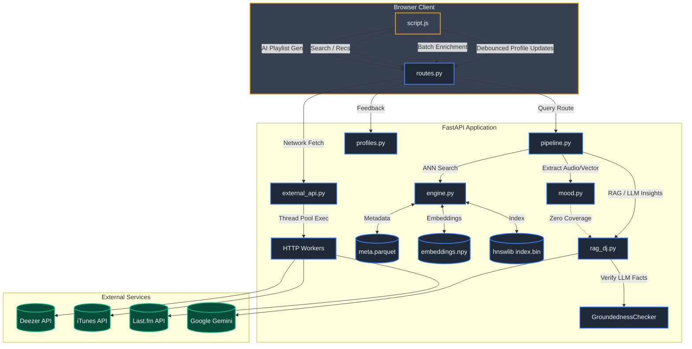

# SoundVector Architecture Details

This document outlines the complete internal architecture of the SoundVector system, detailing every Python module, frontend component, data flow, and caching layer.

---

## 🏗️ System Flowchart

---

## 🧩 Core Components (Backend)

### 1. `routes.py` (API Gateway)
- **FastAPI App**: Handles routing, CORS, and GZip compression.
- **Cache-Control**: Forces HTML to `no-store` and sets aggressive caching for static assets.
- **Endpoints**: `/api/home`, `/api/recommend`, `/api/artist`, `/api/enrich`, `/api/batch_enrich`, `/api/feedback`.
- **Concurrency**: Uses `asyncio.gather` for `/api/home` to fetch personalized sections (Vibe, Artist, Discover) in parallel.

### 2. `pipeline.py` (Query Orchestration)
- **`run_pipeline`**: The brain of the request. Classifies whether a query is a track seed, an artist, or natural language.
- **Regional Logic**: Detects Indian/Regional keywords (Telugu, Hindi, Punjabi) and dynamically restricts the engine to regional base genres.
- **Fallback Chaining**: If TF-IDF `mood.py` fails, asks `rag_dj.py` to project the text.
- **ZeroGPU Compatibility**: Uses `safe_run_pipeline` to wrap execution in `@spaces.GPU` if HuggingFace GPU environments are detected.

### 3. `engine.py` (Recommendation Engine)
- **State**: Loads 899K 256D embeddings, 8D audio features, and HNSW index into memory/mmap.
- **`track_card` & `_genre_ids`**: Heavily optimized with `@functools.lru_cache` to prevent redundant DB lookups during the ranking loop.
- **Canonical Dedup**: `_build_catalog` deduplicates tracks with the exact same name and artist string at startup, choosing the highest popularity instance.
- **Ranking Loop (`recommend`)**: 
  - Retrieves K=2000 from `hnswlib`.
  - Calculates a base score using a weighted sum of: `embed_sim`, `audio_sim`, `genre_sim`, `artist_sim`, `popularity`, and `era_sim`.
  - Uses `max_per_artist` constraints and a `redundancy_cutoff` (vector dot product limit) to ensure list diversity.

### 4. `external_api.py` (Network I/O)
- **`_BoundedCache`**: Custom OrderedDict-based LRU cache to prevent memory leaks while caching external responses.
- **`_HTTP_POOL`**: A `ThreadPoolExecutor(max_workers=16)` shared across all requests.
- **Parallel Fetching**: Uses `concurrent.futures.as_completed` to query Deezer and iTunes simultaneously during track enrichment (`enrich_track`).
- **Artist Info (`enrich_artist_lastfm`)**: Fires `artist.getinfo` and `artist.gettoptracks` in parallel to Last.fm.

### 5. `rag_dj.py` (LLM Integration & Fact Checking)
- **`RAGDJ`**: Wraps the Gemini client. Generates JSON-structured commentary (Headline, Insights, Sound Profile, Mood Tags).
- **`_template_intel`**: A deterministic fallback generator if Gemini is unavailable or API limits are hit, using raw catalog metadata to write human-readable sentences.
- **`GroundednessChecker`**: A post-generation verification layer. Uses `FEATURE_TERMS` (e.g., "upbeat" requires valence >= 0.55) to catch and filter hallucinated audio claims from the LLM.

### 6. `mood.py` (NLP TF-IDF Model)
- **`MoodToVector`**: Loads a pre-trained scikit-learn pipeline (TF-IDF vectorizer + Ridge Regression).
- **Function**: Maps arbitrary user text into a 256D latent embedding vector and an 8D audio feature vector.

### 7. `profiles.py` (Taste Profiles)
- **`ProfileStore`**: Manages JSON-based user state.
- **Taste Vector Blending**: When a user likes a track, their `long_term` and `short_term` vectors are updated using Exponential Moving Average (EMA).
  - `LONG_TERM_DECAY = 0.9` (adapts slowly)
  - `SHORT_TERM_DECAY = 0.6` (adapts quickly)

### 8. `config.py` & `models.py`
- **`config.py`**: Holds global constants (`SCORING_PRESETS`, `BASE_GENRE_MAP`, `SYNONYMS`).
- **`models.py`**: Pydantic schemas validating all incoming API requests (e.g., `BatchEnrichRequest`, `FeedbackRequest`).

---

## 🎨 Frontend Architecture (`script.js`)

The frontend is a vanilla JavaScript application structured around aggressive debouncing and state management.

### Key Optimization Systems
1. **Cache-Busting Initialization**: 
   - An IIFE runs at load comparing `BUILD_VERSION`. If changed, wipes `sessionStorage` and old `localStorage` cache keys to prevent stale UI state on new deploys.
2. **Track Enrichment Batching (`_enrichQueue`)**:
   - Replaces network waterfalls. `queueTrackEnrichment()` pushes tracks to an array. A 30ms debounce timer flushes the array into a single `/api/batch_enrich` POST request.
3. **DOM Manipulation via Cache Hits**:
   - `_applyEnrichmentToDOM()` updates cover arts and listen buttons globally via `data-track-key` selectors when batch data arrives.
4. **Scroll Handlers (`MutationObserver`)**:
   - Instead of polling the DOM, a `MutationObserver` on `.main-content` listens for injected track carousels and attaches mouse-wheel drag handlers.

### Player State
- Uses the native HTML5 `Audio` API.
- Implements seamless track-switching (automatically pauses old track, swaps `src`, and plays new track) when a user clicks a new 30s preview button.

---

## 🔍 Request Lifecycle Example: "Telugu Gym Songs"

1. **Client**: User types "telugu gym songs" and hits enter.
2. **`pipeline.py`**: `is_song_query` confirms it's not a specific track.
3. **`pipeline.py`**: Detects "telugu" → sets strict target genres to `{"filmi", "desi pop", "indian pop"}`.
4. **`mood.py`**: TF-IDF sees "gym" (expanded via `config.py` synonyms to "workout edm dance energy") and outputs a 256D high-energy query vector.
5. **`engine.py`**: K-NN searches the HNSW index for the vector.
6. **`engine.py`**: Filters out non-Telugu genres, scores candidates by vector similarity + popularity.
7. **`rag_dj.py`**: Reads the top 10 Telugu workout tracks, writes a Gemini insight (e.g., *"High-octane Filmi energy hitting 130 BPM"*), and `GroundednessChecker` approves it.
8. **Client**: Receives tracks. Enqueues them for batch enrichment.
9. **`external_api.py`**: Fetches Deezer covers in parallel, returns them to UI.
